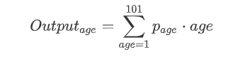
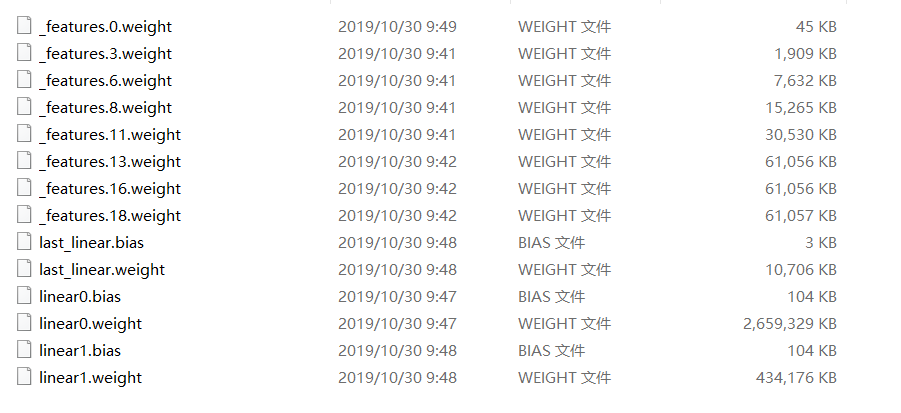
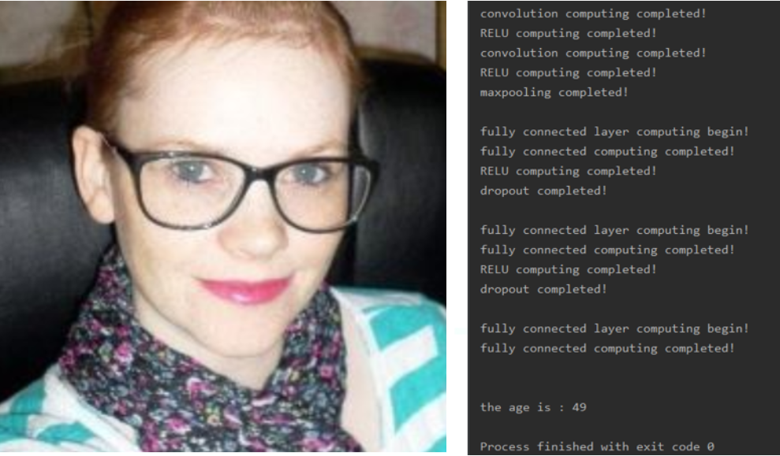

# C语言实现神经网络的前向传播
## background

已有".pth"模型文件,  从模型中读取参数, 接收固定尺寸的人脸图片输入（224 * 224），利用模型， 计算照片中人的年纪。

网络backbone采用的VGG11，将最后一层的输出改成101，预测目标年龄的概率分布。

网络基础架构如下：

```markdown
layer 1
    (0): Conv2d(3, 64, kernel_size=(3, 3), stride=(1, 1), padding=(1, 1))
    (1): ReLU(inplace=True) 
    (2): MaxPool2d(kernel_size=2, stride=2, padding=0, dilation=1, ceil_mode=False)
layer 2   
    (3): Conv2d(64, 128, kernel_size=(3, 3), stride=(1, 1), padding=(1, 1))
    (4): ReLU(inplace=True)
    (5): MaxPool2d(kernel_size=2, stride=2, padding=0, dilation=1, ceil_mode=False)
layer 3
    (6): Conv2d(128, 256, kernel_size=(3, 3), stride=(1, 1), padding=(1, 1))
    (7): ReLU(inplace=True)
layer 4
    (8): Conv2d(256, 256, kernel_size=(3, 3), stride=(1, 1), padding=(1, 1))
    (9): ReLU(inplace=True)
    (10): MaxPool2d(kernel_size=2, stride=2, padding=0, dilation=1, ceil_mode=False)
layer 5
    (11): Conv2d(256, 512, kernel_size=(3, 3), stride=(1, 1), padding=(1, 1))
    (12): ReLU(inplace=True)
    layer 6
    (13): Conv2d(512, 512, kernel_size=(3, 3), stride=(1, 1), padding=(1, 1))
    (14): ReLU(inplace=True)
    (15): MaxPool2d(kernel_size=2, stride=2, padding=0, dilation=1, ceil_mode=False)
layer 7
    (16): Conv2d(512, 512, kernel_size=(3, 3), stride=(1, 1), padding=(1, 1))
    (17): ReLU(inplace=True)
layer 8
    (18): Conv2d(512, 512, kernel_size=(3, 3), stride=(1, 1), padding=(1, 1))
    (19): ReLU(inplace=True)
    (20): MaxPool2d(kernel_size=2, stride=2, padding=0, dilation=1, ceil_mode=False)
  )
fc1 
  (linear0): Linear(in_features=25088, out_features=4096, bias=True)
  (relu0): ReLU(inplace=True)
  (dropout0): Dropout(p=0.5, inplace=False)
fc2
  (linear1): Linear(in_features=4096, out_features=4096, bias=True)
  (relu1): ReLU(inplace=True)
  (dropout1): Dropout(p=0.5, inplace=False)
fc3
  (last_linear): Linear(in_features=4096, out_features=101, bias=True)

softmax()
```

输出目标年纪的101维向量后，用softmax计算年龄的概率分布，把概率当成权值p，总年龄为：



## usage

在main.c文件中设置输入图片和是否保存网络参数。

```cpp
char* FILEPATH = "../face.jpg"; // 尚未完成resize功能，目前只能接受224*224*3的图片输入
bool SAVE_FILE = FALSE;  // 设置全局变量，控制是否保存网络参数，和中间层的feature map
```

## pipeline

- 在python里面将pth文件里面的每层参数打开，分别写入各自name命名的文件中（没有找到C语言下读取pytorch训练模型的API， 先用这种原始的方式读参数）。

  

- 用c读文件，load到相应的conv矩阵中，开始前向传播。

- 输出计算结果

## example

模型在笔记本上训了1个epoch， 准备率较低， 测试图片的输出结果是49岁。



the end~